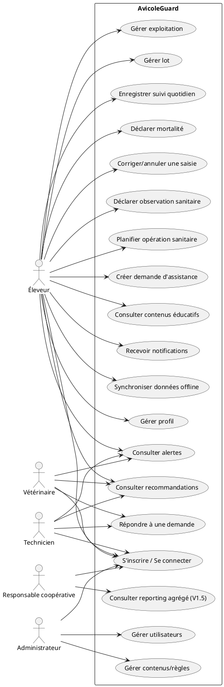
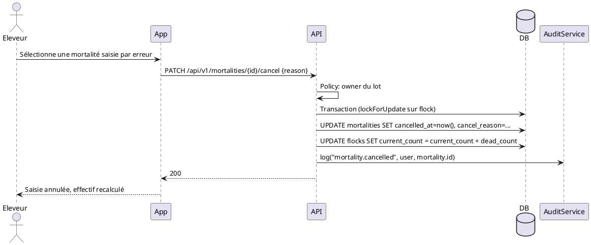

# DOCUMENT 2 — CAHIER DES CHARGES FINAL
## Plateforme mobile intelligente d'accompagnement des acteurs avicoles — AvicoleGuard (V1)

*Version consolidée après audit critique (Document 1). Convention de lecture : **FAIT** = donnée confirmée par une source ou le cadrage projet ; **HYPOTHÈSE** = supposition de travail non vérifiée ; **PROPOSITION** = décision technique/produit suggérée par le comité, à valider par le porteur de projet ; **À VALIDER** = information inconnue nécessitant une vérification terrain ou documentaire.*

---

## 1. Présentation

AvicoleGuard *(PROPOSITION de nom de travail)* est une application mobile (Flutter) adossée à une API Laravel/PostgreSQL, destinée aux éleveurs avicoles, vétérinaires, techniciens et administrateurs, principalement au Burkina Faso, avec une architecture pensée pour une extension régionale ultérieure.

## 2. Contexte

**FAIT** — L'élevage contribue à environ 12 % du PIB du Burkina Faso et occupe près de 72 % de la population active ; l'aviculture concentre près de la moitié du cheptel national<cite index="3-1">, le secteur de l'élevage contribuant à hauteur de 12 % au PIB et occupant environ 72 % de la population, l'aviculture étant une composante majeure du secteur qui concentre à elle seule près de la moitié du cheptel</cite> (source : Agence Ecofin, citant des données sectorielles, 2025 — fiabilité : moyenne-élevée, média spécialisé).

**FAIT** — Selon la FAO (2018), les moyens de subsistance liés à l'aviculture représenteraient l'équivalent de 35 millions de dollars US<cite index="7-1">, soit 27,2 % du PIB de la filière, avec une contribution d'environ 6 % du PIB agricole</cite> (source : FAO, rapport livestock Burkina Faso — fiabilité : élevée, organisation internationale, donnée datée de 2018).

**FAIT** — Le secteur reste dominé par de petites exploitations familiales, la maladie de Newcastle étant citée comme cause de pertes importantes, et les intrants (aliments, poussins, vaccins) restant coûteux et largement importés (source : Centre Digital, article de vulgarisation citant la CCI-BF et FAOSTAT — fiabilité : moyenne, média non académique, à recouper).

**À VALIDER** — Nombre exact d'éleveurs avicoles actifs, répartition par taille d'exploitation (familiale/semi-intensive/intensive), et taux d'équipement en smartphone de ce public spécifique : aucune source publique précise trouvée lors de cet audit ; une étude terrain reste nécessaire.

## 3. Problématique

Analyse en chaîne causale (au lieu d'un énoncé unique "prévenir les maladies") :

```text
PROBLÈME
Suivi sanitaire majoritairement manuel ou absent (cahier papier, mémoire)
↓
CAUSE
- Manque d'outils adaptés au contexte (offline, simplicité, coût)
- Accès limité aux vétérinaires/techniciens en zone rurale (HYPOTHÈSE, cohérente avec la dispersion des petites exploitations familiales)
- Détection tardive des anomalies sanitaires faute d'historique exploitable
↓
CONSÉQUENCE
- Réaction tardive face aux maladies (ex. Newcastle)
- Décisions prises sans données fiables (alimentation, mortalité, croissance)
↓
IMPACT ÉCONOMIQUE
- Pertes de cheptel, retour sur investissement dégradé pour l'éleveur
- Frein à la professionnalisation de la filière (FAIT contextuel : secteur en croissance mais confronté à ces difficultés)
↓
SOLUTION
Application de suivi structuré + moteur de règles explicable + mise en relation avec des professionnels, fonctionnant en conditions de connectivité réelles
```

**PROPOSITION** — Ne pas limiter la proposition de valeur à la seule "prévention des maladies" : la traçabilité et l'aide à la décision (visibilité sur les performances du lot) sont des bénéfices tout aussi centraux, en particulier pour les éleveurs plus expérimentés/professionnels.

## 4. Vision

Devenir, à moyen terme, l'outil de référence de suivi sanitaire et de gestion des lots pour les éleveurs avicoles familiaux et semi-intensifs d'Afrique de l'Ouest, en s'appuyant sur un moteur de règles explicable, une architecture offline-first robuste et un réseau de professionnels de santé animale accessibles depuis l'application. **HYPOTHÈSE**, à confirmer par la traction du pilote terrain (V1).

## 5. Objectifs

### Objectifs fonctionnels
1. Structurer le suivi des exploitations, lots, suivis quotidiens, mortalités et observations.
2. Détecter les anomalies via un moteur de règles explicable, limitant les faux positifs (voir §20).
3. Générer des alertes classées par niveau de risque et des recommandations non assimilables à un diagnostic.
4. Permettre la demande d'assistance vétérinaire/technique et son suivi.
5. Fournir un calendrier sanitaire (planification en MVP ; rappels automatiques en V1.5 — **À MODIFIER par rapport à la V0**, voir audit A5).
6. Fournir une bibliothèque de contenus éducatifs.
7. Fonctionner en mode offline-first pour les opérations essentielles.
8. Garantir l'isolement strict des données par éleveur/exploitation.
9. **[AJOUT audit A12]** Permettre la correction/annulation tracée d'une saisie erronée.

### Objectifs non fonctionnels
- Fonctionnement acceptable sur téléphones Android d'entrée/milieu de gamme et réseau bas débit.
- Consommation de données limitée.
- Architecture évolutive, sans sur-ingénierie au stade MVP (pas de microservices, pas de PostGIS, pas d'IA en V1).
- Explicabilité systématique du moteur d'analyse.

## 6. Périmètre

**Inclus (V1/MVP)** : éleveur, vétérinaire, technicien, administrateur ; suivi complet exploitation→lot→mortalité/observation ; moteur de règles ; alertes/recommandations ; assistance basique ; contenus éducatifs en lecture ; offline-first complet.

**Explicitement exclus du MVP** (voir §32 pour le détail priorisé) : module finance, marketplace, IA prédictive, PostGIS, vision coopérative multi-exploitations complète, rappels automatiques de calendrier sanitaire, affectation automatique des demandes d'assistance.


---

## 7. Utilisateurs

| Rôle | Description | Ajout/modification vs V0 |
|---|---|---|
| Éleveur | Segmenté en 3 profils (§8) | Segmentation ajoutée (audit A2) |
| Vétérinaire | Consulte alertes/demandes affectées, répond, valide/corrige des recommandations | Inchangé |
| Technicien avicole | Rôle équivalent, hors actes médicaux réservés | Inchangé |
| Responsable de coopérative | Vision agrégée sur plusieurs exploitations affiliées | **Acteur ajouté (audit A3)** — modélisé dès le MVP (rôle existe en base), mais fonctionnalités agrégées reportées en V1.5/V2 |
| Administrateur | Utilisateurs, contenus, règles d'alerte, paramètres | Inchangé |

## 8. Personas

*(Enrichissement demandé par l'audit A2 — aucune donnée démographique précise n'est inventée ; les besoins/frustrations restent des HYPOTHÈSES de travail à confirmer en pilote terrain.)*

### Éleveur débutant
- **Objectifs** : ne pas perdre son cheptel par manque d'expérience, apprendre les bonnes pratiques.
- **Difficultés** : ne sait pas reconnaître les signes avant-coureurs, hésite à contacter un professionnel.
- **Niveau numérique** : faible à moyen.
- **Besoins** : contenu éducatif accessible, alertes très explicites avec recommandation concrète.
- **Fréquence d'usage** : quotidienne au début (curiosité/anxiété), risque de décrochage si l'app est perçue comme complexe.

### Éleveur expérimenté
- **Objectifs** : gagner du temps sur le suivi qu'il fait déjà mentalement/sur papier.
- **Difficultés** : peu de patience pour une saisie longue.
- **Niveau numérique** : moyen.
- **Besoins** : saisie rapide (< 2 min/jour), historique exploitable.
- **Fréquence d'usage** : quotidienne, régulière.

### Éleveur professionnel (plusieurs lots/exploitations)
- **Objectifs** : piloter la performance globale, réduire les coûts liés aux pertes.
- **Difficultés** : besoin de vue consolidée multi-lots.
- **Niveau numérique** : moyen à élevé.
- **Besoins** : statistiques comparatives entre lots (COULD HAVE, §32), export éventuel.
- **Fréquence d'usage** : quotidienne à pluri-quotidienne.

### Vétérinaire
- **Objectifs** : répondre efficacement à plusieurs éleveurs sans perdre de temps en contexte manquant.
- **Difficultés** : manque d'historique structuré quand il est sollicité hors plateforme (téléphone, visite).
- **Besoins** : historique complet du lot visible avant de répondre.
- **Fréquence d'usage** : ponctuelle, déclenchée par les demandes.

### Technicien avicole
- Profil proche du vétérinaire, avec un rôle plus orienté accompagnement technique/biosécurité que actes médicaux.

### Responsable de coopérative
- **Objectifs** : suivre la santé globale du cheptel de ses membres, orienter l'accompagnement.
- **Besoins** : reporting agrégé (**reporté en V1.5/V2**, l'acteur existe dès le MVP sans fonctionnalité dédiée complète).

### Administrateur
- **Objectifs** : maintenir la qualité des données de référence (règles d'alerte, contenus).
- **Besoins** : back-office simple, traçabilité des modifications sensibles (audit log, §21).

## 9. Proposition de valeur

| Segment | Pour qui | Quel problème | Quelle solution | Quel bénéfice | Différenciation |
|---|---|---|---|---|---|
| Éleveur | Éleveur avicole familial/semi-intensif | Détection tardive des anomalies, suivi non structuré | Suivi quotidien + moteur de règles + alertes | Réduction des pertes, gain de temps, meilleure décision | Fonctionne réellement hors connexion (contrairement à des solutions purement en ligne) |
| Vétérinaire | Vétérinaire ou clinique | Manque de contexte lors d'une sollicitation | Historique structuré du lot avant intervention | Diagnostic plus rapide et mieux informé | Passerelle directe avec les éleveurs suivis dans l'app |
| Coopérative | Structure d'appui aux éleveurs membres | Manque de visibilité sur l'état sanitaire du groupe | Reporting agrégé (V1.5/V2) | Meilleur ciblage de l'accompagnement | — (reporté) |
| Entreprise (fournisseur d'intrants) | Acteur B2B | Manque de canal direct vers les éleveurs | Partenariat contenu éducatif / visibilité (V2) | Nouveau canal de distribution | — (reporté, **À VALIDER** juridiquement) |
| Administrateur | Porteur de projet / équipe plateforme | Maintenir la qualité du service | Back-office de gestion | Contrôle et amélioration continue | — |

## 10. Parcours utilisateurs

### Parcours principal
```text
Inscription → Création exploitation → Création lot → Suivi quotidien
→ Déclaration mortalité → Analyse automatique → Alerte (si seuil atteint)
→ Recommandation → Action de l'éleveur (acquittement / contact professionnel)
```
Erreurs à couvrir : échec de validation (ex. mortalité > effectif restant, §23), lot clôturé (saisie refusée), session expirée/compte désactivé (blocage avec message clair).

### Parcours assistance
```text
Problème constaté → Déclaration (observation ou demande directe) → Analyse automatique (si applicable)
→ Demande d'assistance vétérinaire/technique → Réponse du professionnel → Suivi/clôture
```
Erreurs à couvrir : aucun professionnel disponible pour affectation (message d'attente explicite, pas d'échec silencieux), demande sans réponse au-delà d'un délai (**À VALIDER** : relance automatique ? escalade ?).

### Parcours offline
```text
Saisie (hors connexion) → Stockage local SQLite (sync_status=pending) → File d'attente locale
→ Retour de connexion → Synchronisation (idempotente) → Confirmation (sync_status=synced)
```
Erreurs à couvrir : conflit détecté (version serveur modifiée entretemps), échec réseau répété (statut "failed" visible et actionnable par l'utilisateur, jamais une perte silencieuse de données), doublon (rejeté proprement côté serveur via `client_uuid`).


---

## 11. Fonctionnalités (audit complet)

| Fonctionnalité | Valeur | Complexité | MVP | Priorité |
|---|---|---|---|---|
| Inscription / connexion / mot de passe oublié | Élevée | Faible | Oui | Must |
| Gestion profil / activation-désactivation compte | Élevée | Faible | Oui | Must |
| Gestion exploitations | Élevée | Faible | Oui | Must |
| Gestion lots | Élevée | Faible | Oui | Must |
| Suivi quotidien | Élevée | Moyenne (offline) | Oui | Must |
| Déclaration mortalité | Élevée | Moyenne (règle transactionnelle) | Oui | Must |
| Correction/annulation d'une saisie **[AJOUT audit]** | Moyenne-Élevée | Moyenne | Oui | Must |
| Observations sanitaires | Élevée | Faible-Moyenne | Oui | Must |
| Moteur de règles + niveau de risque | Élevée | Élevée | Oui | Must |
| Alertes | Élevée | Moyenne | Oui | Must |
| Recommandations | Élevée | Moyenne | Oui | Must |
| Synchronisation offline↔online | Élevée | Élevée | Oui | Must |
| Isolation des données (sécurité) | Élevée | Moyenne | Oui | Must |
| Demande d'assistance (création + affectation manuelle) | Élevée | Moyenne | Oui | Must |
| Réponse professionnel + historique | Élevée | Faible-Moyenne | Oui | Must |
| Notifications in-app (persistées) | Moyenne-Élevée | Faible | Oui | Should |
| Notifications push | Moyenne | Moyenne (dépendance FCM) | Non prioritaire jour 1 | Should |
| Calendrier sanitaire — planification manuelle | Moyenne | Faible | Oui (simplifié) | Should |
| Calendrier sanitaire — rappels automatiques | Moyenne | Moyenne (Scheduler) | **Non — reporté V1.5** | Should→Could pour le MVP strict |
| Contenus éducatifs (lecture) | Moyenne | Faible | Oui | Should |
| Back-office admin contenus/règles | Moyenne-Élevée (nécessaire au fonctionnement réel) | Moyenne | Oui (minimal) | Should |
| Dashboard éleveur | Moyenne | Faible | Oui | Should |
| Statistiques comparatives multi-lots | Moyenne | Moyenne | Non | Could |
| Module finance (dépenses/ventes) | Moyenne | Moyenne | Non | Could |
| Reporting agrégé coopérative | Moyenne-Élevée (dépend du segment B2B) | Élevée | Non | Could |
| Affectation automatique des demandes (proximité/dispo) | Moyenne | Élevée | Non | Could |
| Plusieurs langues | Moyenne (adoption) | Moyenne | Non | Could |
| Marketplace | Faible à ce stade (cadre juridique incertain) | Élevée | Non | Won't |
| IA prédictive | Faible à ce stade (données insuffisantes) | Élevée | Non | Won't |
| PostGIS / géo avancée | Faible à ce stade | Moyenne | Non | Won't |
| Microservices | Nulle au stade MVP | Élevée | Non | Won't |

## 12. Ajout des fonctionnalités manquantes — justification

| Fonctionnalité candidate (liste §10 du prompt d'audit) | Décision | Justification |
|---|---|---|
| Bâtiments (au-delà de l'exploitation) | **À SUPPRIMER du MVP** | Aucune fonctionnalité identifiée n'exploite un niveau "bâtiment" distinct du "lot" pour un petit/moyen éleveur — ajouterait de la complexité sans valeur claire (**À CONFIRMER** si des exploitations multi-bâtiments par lot existent réellement) |
| Races/souches | **VALIDÉ**, déjà couvert (`flocks.breed`) | Donnée simple, forte valeur pour l'analyse de performance |
| Biosécurité (checklist) | **À REPORTER (V1.5)** | Valeur réelle mais nécessite un référentiel métier validé par un expert avicole avant implémentation — pas prêt pour le MVP |
| Nettoyage / désinfection | **VALIDÉ**, déjà couvert via `health_operations` (type `disinfection`) | — |
| Documents / photos | **VALIDÉ partiellement** — photos déjà prévues pour les demandes d'assistance ; documents génériques (factures, certificats) **reportés** | Valeur incertaine sans cas d'usage confirmé |
| Statistiques / rapports avancés | **À REPORTER**, dashboard simple suffit au MVP | Évite la surcharge UX (Règle UX du cadrage) |

## 13. Règles métier

| # | Règle | Statut |
|---|---|---|
| RM1 | `dead_count > 0` sur chaque déclaration de mortalité | VALIDÉ |
| RM2 | `current_count >= 0` en permanence | VALIDÉ |
| RM3 | `current_count <= initial_count` en permanence | VALIDÉ |
| RM4 | Mortalité cumulée sur un lot `<= initial_count`, garantie par transaction + verrou pessimiste | VALIDÉ |
| RM5 | `latitude` entre -90 et 90, `longitude` entre -180 et 180 | VALIDÉ |
| RM6 | Isolation stricte des données par éleveur (Policies systématiques) | VALIDÉ — **priorité absolue confirmée par l'audit sécurité (§21)** |
| RM7 | Aucune nouvelle saisie sur un lot clôturé | VALIDÉ |
| RM8 | Une alerte est générée uniquement par le moteur de règles | VALIDÉ |
| RM9 | Toute recommandation générée automatiquement porte la mention "signal détecté automatiquement, ne remplace pas un avis vétérinaire" tant qu'un professionnel ne l'a pas validée | VALIDÉ, renforcé (§20) |
| RM10 | Toute opération de synchronisation offline est idempotente | VALIDÉ |
| RM11 **[AJOUT]** | Une correction/annulation de saisie est toujours tracée (jamais une suppression physique silencieuse) et recalculée en conséquence (ex. `current_count` réajusté si une mortalité est annulée) | **AJOUT audit A12** |
| RM12 **[AJOUT]** | Une alerte ne peut être générée deux fois pour la même combinaison règle+lot+période sans qu'un délai minimal (ex. 24h) ne se soit écoulé, sauf aggravation confirmée | **AJOUT audit A4 — limite les faux positifs répétitifs** |

## 14. Cas d'utilisation

### Diagramme de cas d'utilisation global (mis à jour — ajout coopérative)



Cas prioritaires MVP : UC1, UC3, UC4, UC5, UC6, UC6b, UC7, UC8, UC9, UC11, UC12, UC15.
UC18 (reporting coopérative) est modélisé pour cohérence UML mais **non implémenté au MVP**.


---

## 15. UML

### 15.1 Diagramme de classes (domaine, mis à jour)

Modifications vs V0 : ajout `cancelledAt`/`cancelReason` sur les entités de saisie terrain, ajout `AuditLog`, ajout `Cooperative` (structure minimale, non pleinement exploitée au MVP).

```plantuml
@startuml
class User {
  - id : UUID
  - name : string
  - email : string
  - phone : string
  - passwordHash : string
  - role : Role
  - isActive : boolean
  - createdAt : datetime
}
enum Role { FARMER; VETERINARIAN; TECHNICIAN; COOPERATIVE_MANAGER; ADMIN }

class Cooperative {
  - id : UUID
  - name : string
  - managerId : UUID
}

class Farm {
  - id : UUID
  - ownerId : UUID
  - cooperativeId : UUID
  - name : string
  - location : string
  - latitude : decimal
  - longitude : decimal
  - capacity : int
}

class Flock {
  - id : UUID
  - farmId : UUID
  - reference : string
  - breed : string
  - sex : Sex
  - initialCount : int
  - currentCount : int
  - arrivalDate : date
  - status : FlockStatus
}
enum Sex { MALE; FEMALE; MIXED }
enum FlockStatus { ACTIVE; CLOSED }

class DailyMonitoring {
  - id : UUID
  - flockId : UUID
  - date : date
  - temperature : decimal
  - waterConsumption : decimal
  - feedConsumption : decimal
  - averageWeight : decimal
  - cancelledAt : datetime
  - cancelReason : string
}

class Mortality {
  - id : UUID
  - flockId : UUID
  - date : date
  - deadCount : int
  - presumedCause : string
  - cancelledAt : datetime
  - cancelReason : string
}

class Observation {
  - id : UUID
  - flockId : UUID
  - date : datetime
  - type : ObservationType
  - description : text
  - cancelledAt : datetime
}
enum ObservationType { ABNORMAL_BEHAVIOR; RESPIRATORY; FEEDING; DIGESTIVE; PLUMAGE; LOCOMOTOR; OTHER }

class HealthAnalysis {
  - id : UUID
  - flockId : UUID
  - runAt : datetime
  - riskLevel : RiskLevel
  - score : decimal
  - confidence : decimal
  - explanation : text
}
enum RiskLevel { INFORMATION; ATTENTION; PREOCCUPANT; CRITIQUE }

class AlertRule {
  - id : UUID
  - code : string
  - description : string
  - thresholdValue : decimal
  - trendWindowDays : int
  - severity : RiskLevel
  - isActive : boolean
}

class Alert {
  - id : UUID
  - flockId : UUID
  - healthAnalysisId : UUID
  - title : string
  - level : RiskLevel
  - status : AlertStatus
  - createdAt : datetime
}
enum AlertStatus { OPEN; ACKNOWLEDGED; CLOSED }

class Recommendation {
  - id : UUID
  - alertId : UUID
  - content : text
  - generatedBy : string
  - validatedByProfessional : boolean
}

class HealthSchedule {
  - id : UUID
  - flockId : UUID
  - type : HealthOperationType
  - plannedDate : date
  - doneDate : date
  - status : string
}
enum HealthOperationType { VACCINATION; DISINFECTION; TREATMENT; DEWORMING; VET_VISIT; OTHER }

class AssistanceRequest {
  - id : UUID
  - farmerId : UUID
  - flockId : UUID
  - subject : string
  - priority : Priority
  - status : RequestStatus
  - assignedToId : UUID
}
enum Priority { LOW; MEDIUM; HIGH; URGENT }
enum RequestStatus { OPEN; ASSIGNED; ANSWERED; CLOSED }

class AssistanceResponse {
  - id : UUID
  - requestId : UUID
  - authorId : UUID
  - message : text
}

class ContentCategory {
  - id : UUID
  - name : string
}

class EducationalContent {
  - id : UUID
  - categoryId : UUID
  - title : string
  - publishedAt : datetime
}

class Notification {
  - id : UUID
  - userId : UUID
  - title : string
  - type : string
  - readAt : datetime
}

class AuditLog {
  - id : UUID
  - userId : UUID
  - action : string
  - entityType : string
  - entityId : UUID
  - occurredAt : datetime
}

User "1" -- "*" Farm : owns >
Cooperative "1" -- "*" Farm : groups (V1.5) >
Farm "1" -- "*" Flock
Flock "1" -- "*" DailyMonitoring
Flock "1" -- "*" Mortality
Flock "1" -- "*" Observation
Flock "1" -- "*" HealthAnalysis
Flock "1" -- "*" HealthSchedule
HealthAnalysis "1" -- "0..1" Alert
Alert "1" -- "*" Recommendation
User "1" -- "*" AssistanceRequest
AssistanceRequest "1" -- "*" AssistanceResponse
ContentCategory "1" -- "*" EducationalContent
User "1" -- "*" Notification
User "1" -- "*" AuditLog
AlertRule "1" -- "*" Alert : triggers >
@enduml
```

### 15.2 Diagramme de séquence — correction/annulation d'une saisie (nouveau, audit A12)



Les 11 autres diagrammes de séquence (inscription, connexion, création exploitation/lot, suivi quotidien, mortalité, analyse sanitaire, génération d'alerte, notification, demande d'assistance, réponse vétérinaire, synchronisation) restent **VALIDÉS sans changement** par rapport à la V0 — voir Document technique précédent pour leur contenu PlantUML complet, repris à l'identique dans l'implémentation.

## 16. Architecture technique

Inchangée dans son principe (VALIDÉ par l'audit) :

```text
┌─────────────────────┐        HTTPS/JSON        ┌──────────────────────────┐
│   App Flutter          │ ───────────────────────▶ │   API Laravel 12 (REST)    │
│   (offline-first)       │ ◀─────────────────────── │   Sanctum + Policies        │
└─────────────────────┘                          └───────────┬──────────────┘
                                                               │
                                            ┌──────────────────┼───────────────────┐
                                            ▼                  ▼                   ▼
                                    PostgreSQL                 Redis (queues)    Stockage fichiers
```

**Confirmation de l'audit** : pas de PostGIS, pas de microservices au MVP (VALIDÉ, cohérent avec Règle 3 du cadrage initial).

## 17. Stack

Inchangée et **VALIDÉE** par l'audit (PHP 8.3+/Laravel 12, Sanctum, Eloquent, PostgreSQL, Flutter/Dart, SQLite via Drift, Docker/Nginx, Redis optionnel, OpenAPI, Pest/PHPUnit). Un seul ajustement :

- **PROPOSITION [ajustement audit A8]** : compléter Firebase Cloud Messaging par des **notifications locales programmées côté Flutter** (ex. `flutter_local_notifications`) pour les rappels qui ne dépendent pas d'un événement serveur récent (ex. rappel de calendrier sanitaire déjà synchronisé), afin de rester utile même en connectivité très intermittente.


---

## 18. Modèle de données

**Changements vs V0 (issus de l'audit)** :
- Ajout de `cancelled_at`, `cancel_reason` sur `daily_monitorings`, `mortalities`, `observations` (RM11).
- Ajout de la table `audit_logs` (traçabilité des actions sensibles, cohérent avec §21).
- Ajout de `cooperatives` et de la colonne `farms.cooperative_id` (nullable), sans fonctionnalité de reporting agrégé exploitée au MVP (acteur modélisé, use case reporté).
- Ajout de `alert_rules.trend_window_days` et `health_analyses.confidence` pour supporter la détection de tendance et réduire les faux positifs (§20).
- **Retrait de la table `transactions` du périmètre MVP** (déplacée en annexe V1.5/V2, §32) — corrige l'incohérence relevée en audit A6.

### Tables ajoutées ou modifiées (delta uniquement — le reste du schéma des 25 autres tables reste celui déjà détaillé dans le cahier technique précédent : `users`, farmer/vet/technician/admin_profiles, `farms`, `flocks`, `daily_monitorings`, `mortalities`, `observations`, `measurements`, `health_operations`, `health_schedules`, `health_analyses`, `alert_rules`, `alerts`, `alert_recipients`, `recommendations`, `alert_recommendations`, `assistance_requests`, `assistance_responses`, `content_categories`, `educational_contents`, `notifications`, `synchronizations`)

#### cooperatives
| Colonne | Type | Null | Défaut | Contraintes |
|---|---|---|---|---|
| id | uuid | non | gen_random_uuid() | PK |
| name | varchar(150) | non | | |
| manager_id | uuid | non | | FK users(id), rôle `cooperative_manager` |
| created_at / updated_at | timestamptz | non | now() | |

#### farms (delta)
Ajout : `cooperative_id uuid NULL REFERENCES cooperatives(id)`.

#### daily_monitorings / mortalities / observations (delta commun)
Ajout : `cancelled_at timestamptz NULL`, `cancel_reason varchar(255) NULL`.
Règle applicative (RM11) : un enregistrement `cancelled_at IS NOT NULL` est exclu de tous les calculs (mortalité cumulée, moyennes, moteur de règles) mais **jamais supprimé physiquement**.

#### alert_rules (delta)
Ajout : `trend_window_days integer NULL` (ex. 3 = comparaison sur une moyenne mobile de 3 jours plutôt qu'un seuil instantané).

#### health_analyses (delta)
Ajout : `confidence numeric(3,2) NULL` (0 à 1, reflète la quantité de données disponibles pour l'analyse — un lot avec 2 jours d'historique a une confiance plus faible qu'un lot avec 3 semaines).

#### audit_logs
| Colonne | Type | Null | Défaut | Contraintes |
|---|---|---|---|---|
| id | uuid | non | gen_random_uuid() | PK |
| user_id | uuid | non | | FK users(id) |
| action | varchar(100) | non | | ex. 'mortality.cancelled', 'alert_rule.updated', 'user.deactivated' |
| entity_type | varchar(50) | non | | |
| entity_id | uuid | non | | |
| metadata | jsonb | oui | | |
| occurred_at | timestamptz | non | now() | |

Index : `(entity_type, entity_id)`, `(user_id, occurred_at)`.

**Table retirée du périmètre MVP** : `transactions` (dépenses/ventes) — conservée en annexe de conception pour la V1.5/V2 (module finance), non migrée en base au MVP afin d'éviter une table sans fonctionnalité (audit A6).

## 19. API

Préfixe `/api/v1`, conventions REST, versionnement par préfixe d'URL (pas de versionnement par en-tête au MVP — **PROPOSITION**, plus simple à opérer). Pagination standard Laravel (`?page=`, `?per_page=`, max 50) sur toutes les listes. Filtres/tri documentés par endpoint dans le fichier OpenAPI (ex. `GET /flocks/{flock}/mortalities?from=&to=&sort=-date`).

### Endpoints ajoutés vs V0 (delta)

| Méthode | URL | Rôle autorisé | Description |
|---|---|---|---|
| PATCH | /daily-monitorings/{id}/cancel | farmer (owner) | Annule un suivi erroné (RM11) |
| PATCH | /mortalities/{id}/cancel | farmer (owner) | Annule une mortalité erronée, recalcule `current_count` |
| PATCH | /observations/{id}/cancel | farmer (owner) | Annule une observation erronée |
| GET | /cooperatives/{coop}/farms | cooperative_manager | Liste des exploitations affiliées (V1.5, endpoint modélisé, non implémenté au MVP) |
| GET | /admin/audit-logs | admin | Consultation du journal d'audit |
| DELETE | /me | authentifié | Demande de suppression de compte (droit à l'oubli, §21) — déclenche une anonymisation différée, pas une suppression immédiate en cascade |

Le reste des endpoints (auth, farms, flocks, daily-monitorings, mortalities, observations, health-analyses, alerts, recommendations, health-schedules, assistance-requests/responses, content-categories/contents, notifications, sync) reste **VALIDÉ sans changement** par rapport à la documentation détaillée du cahier technique précédent (méthode, rôle, validation, réponses 200/201/400/401/403/404/422/500).

### Exemple mis à jour — annulation d'une mortalité

```http
PATCH /api/v1/mortalities/{id}/cancel
```
**Body**
```json
{ "reason": "Erreur de saisie, doublon avec l'enregistrement du matin" }
```
**Réponse 200**
```json
{
  "data": {
    "id": "...",
    "cancelled_at": "2026-08-10T09:15:00Z",
    "cancel_reason": "Erreur de saisie, doublon avec l'enregistrement du matin",
    "flock_current_count": 500
  }
}
```
**422** si la mortalité est déjà annulée. **403** si l'utilisateur n'est pas propriétaire du lot.


---

## 20. Sécurité — audit des menaces

| Menace | Probabilité | Impact | Risque | Mesure corrective |
|---|---|---|---|---|
| Un éleveur accède aux données d'un autre éleveur (faille de Policy) | Faible si tests systématiques | Élevé (confiance) | **Élevé** | Policies sur chaque ressource + tests de sécurité obligatoires en CI (§30) |
| Vol/fuite de token Sanctum (appareil perdu/partagé) | Moyenne (contexte terrain, appareils parfois partagés) | Moyen-Élevé | **Moyen-Élevé** | Révocation de token par appareil (`DELETE /auth/tokens/{id}`), possibilité de déconnexion à distance depuis un nouvel appareil |
| Upload de fichier malveillant via photos d'assistance | Faible | Moyen | Moyen | Validation stricte MIME/taille, stockage privé, URLs signées à durée limitée |
| Attaque par force brute sur `/auth/login` | Moyenne | Moyen | Moyen | Rate limiting (throttle), verrouillage progressif |
| Falsification de mass assignment via API | Faible si discipline de code | Élevé | Moyen | `$fillable` strict systématique, revue de code obligatoire (DoD, §31) |
| Perte de traçabilité en cas de suppression de compte non maîtrisée | Moyenne | Moyen-Élevé (réglementaire) | **Moyen-Élevé** | Anonymisation différée plutôt que suppression en cascade immédiate (§19), conservation des données agrégées nécessaires à l'intégrité des lots d'autres utilisateurs |
| Données locales SQLite lisibles si appareil compromis/partagé | Moyenne (contexte terrain) | Moyen | Moyen | **PROPOSITION**, à arbitrer avec le coût de performance : chiffrement au repos (`sqlcipher`) si le budget/performance le permettent ; sinon, verrouillage applicatif par code PIN local a minima |
| Abus du moteur d'alerte (spam d'alertes déclenché volontairement) | Faible | Faible | Faible | Non prioritaire au MVP |

**Confirmation** : l'isolation des données (RM6) reste la priorité de sécurité absolue du projet, conformément au cadrage initial et à cet audit.

## 21. Offline-first (audit approfondi)

| Aspect | V0 | Modification/confirmation de l'audit |
|---|---|---|
| Données accessibles offline | Exploitations, lots, historique déjà synchronisé | **VALIDÉ**, ajouter explicitement : contenus éducatifs déjà consultés (mise en cache) |
| Données modifiables offline | Suivi, mortalité, observation, demande d'assistance (création) | **VALIDÉ** + ajout : annulation d'une saisie déjà synchronisée doit aussi pouvoir être mise en file d'attente si offline (§19), avec le même mécanisme d'idempotence |
| Identifiants | UUID v4 côté client | VALIDÉ |
| Synchronisation | Push + pull incrémental (`since=`) | VALIDÉ |
| Retry | Backoff exponentiel plafonné | VALIDÉ |
| Conflits | Comparaison de version, "dernier gagnant serveur" pour les entités modifiables | **VALIDÉ pour le MVP**, **À CONFIRMER en pilote** si cette stratégie simple est suffisante ou si une notification explicite de conflit à l'utilisateur est nécessaire dans tous les cas (actuellement limitée aux cas de modification, pas de création) |
| Suppression/versionnement | Non traité en V0 | **AJOUT** : les "suppressions" sont toujours des annulations logiques (`cancelled_at`), jamais des suppressions physiques côté mobile ni serveur, ce qui simplifie la synchronisation (pas de gestion de tombstones complexe) |
| Statuts locaux | `PENDING/SYNCING/SYNCED/FAILED/CONFLICT` | VALIDÉ, ajout d'un état `CANCELLED_PENDING` pour une annulation faite offline en attente de synchronisation |

```text
OFFLINE
↓
Création ou annulation locale (SQLite, sync_status=pending / cancelled_pending)
↓
File d'attente locale (sync_queue)
↓
Connexion rétablie
↓
Synchronisation (idempotente par client_uuid)
↓
success (synced) / conflict (résolution serveur-gagnant + notification) / failed (retry avec backoff)
```

## 22. Analyse sanitaire — moteur de règles amélioré

Réponse à l'audit A4 (faux positifs) :

```text
Données (suivi, mortalité, observations, historique du lot)
↓
Normalisation (par effectif du lot, par âge du lot)
↓
Calcul d'indicateurs (taux de mortalité glissant, écart à la moyenne mobile eau/aliment/poids, fréquence d'observations)
↓
Règles (seuil instantané ET/OU tendance sur trend_window_days)
↓
Score pondéré + niveau de confiance (fonction de la profondeur d'historique disponible)
↓
Niveau de risque (INFORMATION/ATTENTION/PREOCCUPANT/CRITIQUE)
↓
Alerte (si niveau >= ATTENTION ET pas de doublon récent — RM12)
↓
Recommandation (adaptée au niveau + mention "signal, pas diagnostic")
```

**Mesures anti-faux-positifs (ajout audit)** :
1. Comparaison sur moyenne mobile plutôt que valeur brute d'un seul jour, quand `trend_window_days` est défini sur la règle.
2. `confidence` réduite (donc alerte non déclenchée ou requalifiée en INFORMATION) si le lot a moins de N jours d'historique (**PROPOSITION** : N=3, **À VALIDER** avec un expert avicole).
3. RM12 : anti-répétition d'alerte pour la même règle/lot dans une fenêtre de 24h, sauf aggravation confirmée (score en hausse).
4. Toute règle reste individuellement activable/désactivable, permettant un ajustement rapide en pilote terrain si un taux de faux positifs excessif est observé.

**Rappel Règle 5 (santé animale)** : la frontière observation → analyse → alerte → recommandation → diagnostic reste strictement respectée :
- *Observation* : "Les poulets toussent" (saisie brute de l'éleveur).
- *Analyse automatique* : "Plusieurs indicateurs sont anormaux (observations respiratoires répétées + baisse de consommation d'eau)".
- *Alerte* : "Niveau de risque PRÉOCCUPANT".
- *Recommandation* : "Vérifier la ventilation du bâtiment et envisager de contacter un professionnel".
- *Diagnostic* : uniquement produit par un vétérinaire humain, jamais par le système.

## 23. Alertes

Inchangé dans sa structure (VALIDÉ), avec application de RM12 (anti-répétition) et de `confidence` dans le calcul du niveau.

## 24. Recommandations

Inchangé (VALIDÉ), avec renforcement du wording (RM9) et mécanisme de correction par un professionnel déjà prévu en V0, confirmé pertinent.

## 25. Assistance

Inchangé pour le MVP (affectation manuelle). **À REPORTER** : affectation automatique par disponibilité/proximité (dépend d'un réseau de professionnels suffisant, données non disponibles à ce stade — voir §26).


---

## 26. Notifications

Inchangé (VALIDÉ), avec l'ajout **PROPOSITION** du §17 : notifications locales programmées côté Flutter en complément du push serveur (FCM), pour rester utile en connectivité très intermittente.

## 27. Contenus

Inchangé (VALIDÉ) : bibliothèque `content_categories` → `educational_contents`, back-office minimal, mise en cache locale du contenu déjà consulté.

## 28. UX/UI (audit)

Constat de l'audit : la V0 définissait déjà des écrans simples et un dashboard limité à 7 indicateurs — **VALIDÉ**, bonne pratique conservée. Points d'amélioration :

| Constat | Statut | Action |
|---|---|---|
| Formulaire de suivi quotidien avec 5 champs numériques d'un coup | À MODIFIER | Regrouper en saisie rapide avec valeurs par défaut pré-remplies (dernière valeur connue), pour rester sous 2 min/jour (persona éleveur expérimenté, §8) |
| Wording des alertes uniquement textuel | À MODIFIER | Ajouter un code couleur normalisé et cohérent avec le niveau de risque (ex. jaune/orange/rouge), testé avec de vrais éleveurs peu technophiles avant généralisation |
| Écran "Assistance" | VALIDÉ | Fil de discussion simple, cohérent avec les usages (WhatsApp-like), pas de sur-conception |
| Navigation générale | VALIDÉ | 5 sections maximum en barre de navigation principale (Dashboard, Exploitations, Alertes, Assistance, Profil), le reste accessible en sous-navigation — **PROPOSITION**, à valider en test utilisateur |
| Annulation d'une saisie (nouvel écran) | AJOUT | Action accessible directement depuis l'historique du lot, avec confirmation explicite et champ de motif obligatoire (traçabilité RM11) |

## 29. IA — roadmap

Réponse structurée à l'audit §13 :

| Question | Réponse |
|---|---|
| Est-elle réellement nécessaire au MVP ? | Non — le moteur de règles explicable couvre le besoin V1 (Règle 5 du cadrage, confirmée par l'audit) |
| Quelles données nécessaires ? | Historique structuré (suivi, mortalité, observations) + issues confirmées par un professionnel sur un nombre significatif de cycles de lot |
| Quand pourra-t-elle être utilisée ? | Après un volume de données réel suffisant, **postérieur au pilote terrain (V1)** — **Donnée à valider**, pas de volume précis engageable aujourd'hui |
| Quel problème doit-elle résoudre ? | Affiner le niveau de confiance et anticiper un risque avant l'apparition de signaux explicites (fenêtre 48-72h), en complément du moteur de règles, jamais en remplacement |
| Quel modèle ? | Modèle interprétable (arbre de décision/gradient boosting avec explication SHAP), pas de boîte noire |
| Mesurer la performance ? | Recall prioritaire sur la classe "risque élevé", validation croisée temporelle |
| Éviter les biais ? | Vérifier la représentativité des zones/souches/saisons dans les données collectées avant tout entraînement |
| Expliquer les résultats ? | Le moteur de règles explicite reste actif en parallèle comme garde-fou explicable, même après introduction de l'IA |

```text
V1 — Règles métier explicables (MVP, ce document)
↓
V1.5 — Analyse statistique descriptive (tendances multi-lots, comparatifs, sans prédiction)
↓
V2 — Machine Learning supervisé (prédiction de risque à 48-72h, modèle interprétable)
↓
V3/V4 — Prédiction avancée (multi-variables, possible intégration image/son si pertinence confirmée — **hautement spéculatif, aucune donnée ne permet de l'engager aujourd'hui**)
```

**Confirmation de l'audit** : ne pas intégrer d'IA avant la V2, et seulement si le volume et la qualité des données collectées via le moteur de règles le justifient.

## 30. Business model (audit)

| Modèle | Client payeur | Valeur | Prix à tester | Coûts | Avantages | Risques | Difficulté |
|---|---|---|---|---|---|---|---|
| Freemium | Éleveur (conversion) | Fonctionnalités avancées (statistiques, multi-lots) | **Aucun prix ne peut être avancé sans étude terrain — À VALIDER** | Faible-modéré | Adoption large | Conversion probablement faible en zone rurale à pouvoir d'achat limité (HYPOTHÈSE) | Modérée |
| Abonnement | Éleveur professionnel principalement | Suivi complet sans limite | À VALIDER | Modéré | Revenu récurrent | Résistance au paiement récurrent pour petits éleveurs | Modérée |
| B2B coopératives | Coopérative/structure d'appui | Reporting agrégé (V1.5/V2) | À VALIDER | Modéré-élevé (effort commercial) | Ticket plus élevé, cohérent avec le rôle "responsable coopérative" désormais modélisé | Cycle de vente long | Élevée |
| Commission assistance | Éleveur ou professionnel (à trancher) | Mise en relation fiable | À VALIDER | Modéré | Aligné sur la valeur délivrée | Nécessite volume de transactions et un cadre de paiement mobile sécurisé | Élevée |
| Marketplace | Éleveur | Achat d'intrants | À VALIDER | Élevé | Revenu additionnel | Cadre réglementaire à vérifier (vente de produits vétérinaires notamment) | Élevée — **reporté** |
| Partenariats (fournisseurs, ONG, projets agricoles) | Institution/entreprise | Visibilité, canal de distribution | À VALIDER | Modéré | Revenu non dépendant du pouvoir d'achat individuel des éleveurs | Dépendance à peu de partenaires | Élevée |

**Confirmation de l'audit** : aucun prix ni taux de conversion ne doit être présenté comme validé. Le modèle B2B coopératives gagne en cohérence avec l'ajout de l'acteur "responsable de coopérative" (§7-8), mais reste, comme les autres, à valider par une étude terrain.

## 31. Étude de marché (sourcée)

### 31.1 Contexte sectoriel (sources publiques)

- Le secteur de l'élevage contribue à environ 12 % du PIB burkinabè et emploie près de 72 % de la population active ; l'aviculture concentre près de la moitié du cheptel<cite index="3-1">, le secteur de l'élevage contribuant à hauteur de 12 % au PIB et occupant environ 72 % de la population, l'aviculture étant une composante majeure du secteur qui concentre à elle seule près de la moitié du cheptel</cite> — *Source : Agence Ecofin, 2025 — fiabilité moyenne-élevée.*
- Le pays comptait environ 50 millions de volailles selon un rapport FAO cité par un article spécialisé, avec une production d'œufs estimée à environ 9 145 tonnes en 2023 pour un besoin annuel estimé à 30 000 tonnes<cite index="6-1">Le pays compte environ 50 millions de volailles, et la production d'œufs au Burkina Faso en 2023 est estimée à 9 145,08 tonnes, face à un besoin annuel estimé à 30 000 tonnes</cite> — *Source : Investir au Burkina, citant FAO 2019 — fiabilité moyenne, à recouper avec la source FAO primaire si besoin.*
- La consommation moyenne journalière de poulets à l'échelle nationale dépassait 10 000 poulets/jour en 2024 selon la CCI-BF, pour une production nationale 2022 estimée à environ 150 000 tonnes<cite index="4-1">Selon la CCI-BF, la consommation moyenne journalière en 2024 était supérieure à dix mille poulets ; en 2022, la production nationale atteignait environ 150 000 tonnes, pour une valeur estimée à 188 milliards de francs CFA selon FAOSTAT</cite> — *Source : Centre Digital, citant CCI-BF/FAOSTAT — fiabilité moyenne (média de vulgarisation).*
- Le secteur reste dominé par de petites exploitations familiales et confronté à des pertes dues aux maladies (Newcastle citée) et au coût des intrants importés<cite index="4-1">Le secteur reste largement dominé par de petites exploitations familiales ; les maladies, notamment la maladie de Newcastle, provoquent des pertes importantes, et les intrants comme l'alimentation animale, les poussins et les vaccins restent coûteux, en grande partie importés</cite> — *Même source.*
- Les moyens de subsistance liés à l'aviculture représenteraient l'équivalent de 35 millions de dollars US, soit 27,2 % du PIB de la filière élevage<cite index="7-1">Les impacts de l'aviculture sur les moyens de subsistance correspondent à 35 millions de dollars E.-U, soit 27,2 pour cent du PIB de la filière</cite> — *Source : FAO, 2018 — fiabilité élevée mais donnée datée.*

**À VALIDER** : nombre exact d'éleveurs actifs, taille moyenne des élevages ciblés par l'application, taux d'équipement smartphone du public visé — aucune source publique précise identifiée lors de cette recherche.

### 31.2 Solutions numériques existantes (concurrents directs/indirects identifiés)

| Solution | Positionnement | Pertinence pour AvicoleGuard |
|---|---|---|
| 123POULTRY (Champrix) | Application conçue spécifiquement pour les éleveurs de volaille en Afrique subsaharienne<cite index="14-1">L'application est conçue pour les éleveurs de volaille en Afrique subsaharienne, mais elle convient aux agriculteurs du monde entier</cite> ; données hébergées aux Pays-Bas | **Concurrent direct potentiel le plus proche identifié** — à étudier en détail (fonctionnalités, prix, présence effective au Burkina Faso) — *Source : site Champrix — fiabilité moyenne (source commerciale)* |
| G-Avicole (Togo) | Solution développée par un entrepreneur togolais pour optimiser la gestion des fermes avicoles<cite index="15-1">une solution numérique développée par le Togolais Kokou Adjeyi pour optimiser la gestion des fermes avicoles</cite> | Concurrent indirect régional (Afrique de l'Ouest) — *Source : SciDev.Net — fiabilité moyenne-élevée (média spécialisé sciences/développement)* |
| Easy Poultry Manager / "Gestionnaire Volaille & Poulet" | Application généraliste de gestion avicole (œufs, alimentation, santé, finances)<cite index="11-1">Easy Poultry Manager vous aide à suivre vos troupeaux, la production d'œufs, l'alimentation, la santé, les finances, les stocks et les sauvegardes</cite>, disponible notamment sur l'App Store dans des pays africains francophones | Concurrent indirect généraliste, pas de mention d'offline-first ni de moteur d'alerte sanitaire spécifique | *Source : Apple App Store — fiabilité moyenne* |
| Aniprev (France) | Solution professionnelle de pilotage avicole avec saisie hors connexion pour structures d'encadrement<cite index="10-1">Le Smartphone ou la tablette de saisie utilisés peuvent travailler en mode déconnecté dans des lieux mal couverts par le wifi</cite> | Concurrent indirect (marché français, structures d'encadrement plutôt que petits éleveurs individuels) — utile comme référence fonctionnelle offline-first | *Source : Réussir Volailles — fiabilité élevée (presse professionnelle agricole)* |

**Conclusion de l'audit** : contrairement à la V0 (aucun concurrent identifié), il existe bien un paysage concurrentiel, avec au moins une solution positionnée spécifiquement sur l'Afrique subsaharienne (123POULTRY). **À VALIDER** : présence réelle et adoption de ces solutions au Burkina Faso spécifiquement, leur tarification exacte, et leur couverture fonctionnelle précise en matière de moteur d'alerte sanitaire explicable (différenciateur potentiel d'AvicoleGuard, non confirmé comme unique).

## 32. SWOT

| Forces | Faiblesses |
|---|---|
| Approche offline-first conçue dès l'architecture (pas ajoutée après coup) | Projet en phase initiale, aucune traction utilisateur |
| Moteur de règles explicable + garde-fous anti-faux-positifs (§22) | Dépendance à un réseau de professionnels partenaires encore à construire |
| Isolation stricte des données, priorité de conception | Aucune étude de marché terrain propre au projet (données sectorielles générales seulement) |
| Secteur avicole burkinabè significatif et en croissance (sources §31.1) | Concurrence déjà existante, dont au moins un acteur positionné régionalement (123POULTRY) |

| Opportunités | Menaces |
|---|---|
| Secteur en croissance, demande urbaine croissante<cite index="4-1">la demande ne cesse de croître dans les grandes villes comme Ouagadougou et Bobo-Dioulasso, et l'urbanisation rapide transforme les modes de consommation</cite> | Faible pouvoir d'achat de certains segments, incertitude sur la disposition à payer |
| Pertes économiques actuelles dues aux maladies (Newcastle notamment) laissant une marge de valeur à capter | Solutions concurrentes déjà présentes sur le créneau Afrique/gestion avicole |
| Partenariats possibles avec coopératives (acteur désormais modélisé) et ONG | Connectivité/coût des données pouvant freiner l'adoption malgré l'offline-first |


---

## 33. KPI

*(Absents en V0 — ajout complet demandé par l'audit A14. Aucune valeur cible n'est inventée ; à définir après le pilote terrain, Phase V1.)*

### KPI produit
- Utilisateurs inscrits (par rôle).
- Utilisateurs actifs (7/30 jours).
- Nombre de lots actifs suivis.
- Nombre de suivis quotidiens enregistrés / lot / semaine (proxy d'engagement).
- Taux de rétention à 30/90 jours.

### KPI aviculture (valeur métier)
- Taux de mortalité moyen des lots suivis, dans le temps.
- Fréquence des alertes générées, par niveau.
- **Taux de faux positifs perçu** (mesuré via le taux d'alertes marquées "non pertinentes" par l'éleveur ou le professionnel — indicateur clé pour ajuster le moteur de règles, §22).
- Délai moyen entre alerte et action (acquittement, contact professionnel).
- Taux de suivi quotidien réel (jours avec saisie / jours actifs du lot).

### KPI business (post-pilote uniquement)
- Taux de conversion gratuit → premium (si freemium retenu).
- Revenu mensuel récurrent.
- Coût d'acquisition utilisateur.
- Churn.
- Revenu moyen par utilisateur.

**Objectifs cibles** : à définir uniquement après le pilote terrain (Phase 10/V1, voir §35) — aucune valeur numérique cible n'est fixée dans ce document.

## 34. MVP (redéfini)

Démonstration minimale exigée (conforme au prompt d'audit) :
```text
Créer compte → Créer exploitation → Créer lot → Suivre lot
→ Déclarer mortalité → Analyser → Alerter → Recommander
```

### MUST HAVE
Authentification, gestion profil, exploitations, lots, suivi quotidien, mortalité (+ correction/annulation RM11), observations, moteur de règles avec anti-faux-positifs de base (RM12, trend_window), alertes, recommandations, offline-first complet et testé, isolation des données, demande d'assistance basique (création + affectation manuelle + réponse).

### SHOULD HAVE
Notifications in-app, notifications push, calendrier sanitaire (planification manuelle uniquement, sans rappel automatique), contenus éducatifs (lecture), back-office admin minimal, dashboard éleveur.

### COULD HAVE
Rappels automatiques de calendrier sanitaire, statistiques multi-lots, affectation automatique de l'assistance, plusieurs langues, reporting agrégé coopérative (V1.5).

### WON'T HAVE (V1)
Module finance, marketplace, IA prédictive, PostGIS, microservices.

## 35. Roadmap (versions)

| Version | Fonctionnalités | Objectif | Utilisateurs | Dépendances | Indicateur de réussite |
|---|---|---|---|---|---|
| V0 — Prototype | Maquettes, validation UX des écrans clés (formulaires courts, code couleur alertes) | Valider les hypothèses UX avant développement | Équipe interne + quelques éleveurs pilotes | Ce cahier des charges validé | Retours utilisateurs qualitatifs positifs sur la simplicité perçue |
| V1 — MVP | Voir §34 MUST/SHOULD HAVE | Démontrer le flux principal en conditions réelles | Éleveurs pilotes, 1-2 vétérinaires/techniciens partenaires | V0 | Flux complet utilisable de bout en bout, y compris offline, sans bug bloquant |
| V1.5 — Assistance & calendrier étendu | Rappels automatiques, biosécurité (checklist), reporting coopérative basique | Approfondir la valeur pour les segments professionnel/coopérative | Éleveurs professionnels, coopératives | V1 stabilisé, retours du pilote | Adoption confirmée par au moins un partenaire coopérative (**À VALIDER**) |
| V2 — Intelligence | Analyse statistique multi-lots, premiers modèles ML interprétables (§29) | Affiner la détection au-delà du moteur de règles | Tous | Volume de données suffisant issu de V1/V1.5 (**donnée à valider**) | Amélioration mesurable du recall sur les alertes pertinentes |
| V3 — Plateforme B2B | Module finance, marketplace (sous réserve juridique), API partenaires | Diversifier les revenus | Coopératives, entreprises, fournisseurs | Traction confirmée en V1/V1.5/V2 | Revenus B2B mesurables (**aucune cible chiffrée avancée ici**) |

## 36. Backlog (format EPIC / User Story)

*(Restructuration demandée par l'audit A15 — extrait représentatif, à compléter de façon exhaustive lors du chiffrage projet.)*

```text
EPIC : Authentification & Comptes
 ├── US-AUTH-001 : Inscription éleveur
 │    Backend : migration users, FormRequest, AuthController::register, tests Feature
 │    Mobile   : écran Register, validation locale, appel API, gestion erreurs 422
 │    Tests    : unit (hash password), feature (register), security (email dupliqué)
 ├── US-AUTH-002 : Connexion
 ├── US-AUTH-003 : Mot de passe oublié

EPIC : Gestion des exploitations et lots
 ├── US-FARM-001 : Créer une exploitation
 │    Backend : migration farms, FarmPolicy, FarmController::store, FarmResource, tests
 │    Mobile   : écran création, stockage local si offline, sync
 ├── US-FLOCK-001 : Créer un lot
 ├── US-FLOCK-002 : Clôturer un lot

EPIC : Suivi terrain
 ├── US-MON-001 : Enregistrer un suivi quotidien (offline-first)
 ├── US-MORT-001 : Déclarer une mortalité (avec verrou transactionnel RM4)
 ├── US-MORT-002 : Annuler une mortalité (RM11)
 │    Backend : MortalityController::cancel, transaction, AuditLog, tests
 │    Mobile   : écran historique, action "Annuler", champ motif obligatoire
 ├── US-OBS-001 : Déclarer une observation sanitaire

EPIC : Moteur d'analyse & alertes
 ├── US-HEALTH-001 : Implémenter AlertRuleEvaluator (mortality_threshold)
 ├── US-HEALTH-002 : Implémenter la gestion des tendances (trend_window_days)
 ├── US-HEALTH-003 : Anti-répétition d'alerte (RM12)
 ├── US-ALERT-001 : Générer une alerte + recommandations liées
 ├── US-ALERT-002 : Acquitter/clôturer une alerte

EPIC : Synchronisation offline
 ├── US-SYNC-001 : File d'attente locale (sync_queue) + SyncQueueWorker
 ├── US-SYNC-002 : Endpoint push idempotent par client_uuid
 ├── US-SYNC-003 : Endpoint pull incrémental (since=)
 ├── US-SYNC-004 : Résolution de conflit (dernier gagnant serveur + notification)

EPIC : Assistance vétérinaire
 ├── US-ASSIST-001 : Créer une demande d'assistance
 ├── US-ASSIST-002 : Répondre à une demande (vétérinaire/technicien)
 ├── US-ASSIST-003 : Clôturer une demande

EPIC : Contenus éducatifs & Back-office admin
 ├── US-CONTENT-001 : CRUD catégories/contenus (admin)
 ├── US-CONTENT-002 : Consultation + mise en cache mobile

EPIC : Sécurité & Audit
 ├── US-SEC-001 : Policies systématiques sur toutes les ressources
 ├── US-SEC-002 : Journal d'audit (audit_logs) sur actions sensibles
 ├── US-SEC-003 : Suppression de compte (anonymisation différée)
```

## 37. Tests

Inchangé et **VALIDÉ** (Unit / Feature / Security / Synchronisation, cf. cahier technique précédent), avec ajout de tests dédiés :
- **RM11** : annulation d'une mortalité recalcule correctement `current_count`, et l'enregistrement annulé est bien exclu du calcul du moteur de règles.
- **RM12** : une deuxième mortalité franchissant le même seuil dans les 24h ne génère pas de nouvelle alerte, sauf aggravation (score en hausse) — test dédié `HealthAnalysisServiceTest`.
- **Sécurité** : tentative d'un vétérinaire non affecté d'accéder à une demande d'assistance d'un éleveur (403).

## 38. Déploiement

Inchangé et **VALIDÉ** : VPS + Docker Compose au MVP (Laravel + PostgreSQL + Redis + Nginx), migration vers offre managée si la charge l'impose. Prix non engagés (**Donnée à valider** au moment du déploiement).

## 39. Risques (registre consolidé)

| Risque | Probabilité | Impact | Niveau | Mitigation |
|---|---|---|---|---|
| Absence d'étude de marché terrain propre au projet | Élevée | Élevé | **Élevé** | Réaliser une étude terrain minimale avant la V1.5 ; s'appuyer sur les sources déjà identifiées (§31) en attendant |
| Faux positifs du moteur de règles → désengagement | Moyenne-Élevée | Élevé | **Élevé** | Mesures §22 (tendance, confiance, RM12) + KPI dédié (§33) |
| Complexité sous-estimée de l'offline-first | Élevée | Élevé | **Élevé** | Prioriser tôt dans la roadmap (V1), tests dédiés obligatoires |
| Faible disponibilité de professionnels partenaires | Moyenne | Moyen-Élevé | Moyen-Élevé | Construire le réseau en parallèle du développement, dès le pilote V1 |
| Concurrence déjà existante (123POULTRY notamment) | Moyenne (présence confirmée en Afrique subsaharienne, adoption locale **à valider**) | Moyen | Moyen | Différenciation sur l'explicabilité du moteur de règles et le vrai offline-first ; validation terrain de la différenciation perçue |
| Cadre juridique incertain pour marketplace/vente de données agrégées | Faible (car reporté) | Moyen si activé prématurément | Faible tant que reporté | Ne pas activer avant vérification juridique explicite |
| Sécurité/isolation mal implémentée | Faible si Policies systématiques | Élevé | Moyen | Tests de sécurité obligatoires en CI + revue de code dédiée (DoD, §40) |
| Sous-estimation des coûts d'infrastructure/notifications | Moyenne | Moyen | Moyen | Suivre l'usage réel en pilote avant généralisation |
| Adoption faible malgré bonne exécution technique | Inconnue | Élevé | **À VALIDER** | Pilote terrain avant tout engagement commercial |

## 40. Critères d'acceptation (mis à jour)

### Création d'un lot
```gherkin
Étant donné un éleveur authentifié propriétaire d'une exploitation
Lorsqu'il crée un lot valide (souche, effectif initial > 0, date d'arrivée)
Alors le lot est enregistré, l'effectif actuel égale l'effectif initial,
et le lot est utilisable hors connexion dès sa création locale
```

### Mortalité
```gherkin
Étant donné un lot actif de 500 volailles (effectif actuel = 500)
Lorsque l'éleveur déclare 5 morts
Alors la mortalité est enregistrée, l'effectif actuel devient 495,
le moteur d'analyse est déclenché,
et une alerte n'est créée que si le niveau de risque calculé est >= ATTENTION
```

### Annulation d'une saisie [AJOUT]
```gherkin
Étant donné une mortalité de 5 morts précédemment enregistrée sur un lot (effectif actuel = 495)
Lorsque l'éleveur annule cette mortalité avec un motif
Alors l'enregistrement est marqué annulé (jamais supprimé),
l'effectif actuel redevient 500,
et un enregistrement d'audit est créé
```

### Anti-répétition d'alerte [AJOUT]
```gherkin
Étant donné une alerte ATTENTION déjà générée pour un lot dans les dernières 24h sur la règle mortality_threshold
Lorsqu'une nouvelle mortalité franchit à nouveau le même seuil sans aggravation du score
Alors aucune nouvelle alerte n'est créée pour cette règle sur ce lot dans la fenêtre de 24h
```

### Isolation des données
```gherkin
Étant donné deux éleveurs authentifiés A et B, chacun propriétaire de ses exploitations
Lorsque l'éleveur A tente de consulter une exploitation appartenant à B
Alors la requête est rejetée avec un statut 403
```

### Synchronisation offline
```gherkin
Étant donné un suivi quotidien créé hors connexion avec un client_uuid donné
Lorsque la synchronisation est rejouée deux fois pour le même client_uuid
Alors un seul enregistrement existe côté serveur pour ce client_uuid
```


---

## 41. Definition of Done

Une fonctionnalité n'est considérée **terminée** que si, cumulativement :
- [ ] Code écrit et respectant les conventions Laravel/Flutter (pas de code mort, pas de duplication).
- [ ] Validation des entrées (FormRequest côté API, validation locale côté mobile).
- [ ] Tests écrits et passants (Unit/Feature, et Security/Sync si applicable).
- [ ] Policy de sécurité vérifiée pour toute ressource exposée (isolation des données, RM6).
- [ ] Documentation API à jour (annotation OpenAPI/Swagger).
- [ ] Comportement offline défini et testé si la fonctionnalité concerne une donnée saisie sur le terrain.
- [ ] Wording validé conforme à la Règle 5 (jamais "diagnostic" pour une sortie automatique).
- [ ] Migration(s) associée(s) rejouable(s) sans erreur sur une base vierge.
- [ ] Logs/audit ajoutés si l'action est sensible (§20, §36 EPIC Sécurité).
- [ ] Revue de code effectuée par une deuxième personne (ou a minima checklist d'auto-revue si équipe réduite — **PROPOSITION**).

## 42. Vérification de cohérence globale

| Niveau | Vérification | Résultat de l'audit |
|---|---|---|
| Cahier ↔ Cas d'utilisation | Chaque fonctionnalité MUST HAVE a un cas d'utilisation correspondant (§14) | OK — UC6b (annulation) ajouté pour couvrir RM11 |
| Cas d'utilisation ↔ Classes | Chaque acteur du diagramme de cas d'utilisation existe dans le modèle (`User.role`) | OK — `cooperative_manager` ajouté à l'enum `Role` |
| Classes ↔ Base PostgreSQL | Chaque classe du diagramme correspond à une table (§18) | OK, à une exception near : `Cooperative`/`cooperatives` ajoutée, `AuditLog`/`audit_logs` ajoutée |
| Base ↔ Fonctionnalités | Aucune table sans fonctionnalité MVP l'utilisant | **Corrigé** : `transactions` retirée du périmètre MVP (audit A6) |
| Base ↔ API | Chaque table exposée a ses endpoints (CRUD pertinents) | OK, endpoints delta ajoutés en §19 (`cancel`, `audit-logs`, `DELETE /me`) |
| API ↔ Mobile | Chaque endpoint utilisé a un écran/action mobile correspondant (§28) | OK, écran d'annulation ajouté |
| Offline | Les flux MUST HAVE fonctionnent hors connexion | OK, confirmé §21, avec l'ajout de l'état `CANCELLED_PENDING` |
| Sécurité | Isolation des données garantie sur toutes les ressources nouvelles | OK, Policies étendues implicitement aux nouvelles ressources (`cancel`, `audit-logs` réservé admin) |
| Business | Modèle économique présenté sans chiffre validé non sourcé | OK, toutes les valeurs restent "À VALIDER" (§30) |
| MVP | Périmètre limité et cohérent avec la démonstration exigée (§26 du prompt d'audit) | OK, calendrier sanitaire simplifié, module finance et reporting coopérative reportés |
| IA | Non utilisée au MVP, roadmap conditionnée à des données réelles | OK (§29) |

Aucune contradiction bloquante résiduelle identifiée à l'issue de cette vérification.

## 43. Recommandations finales

1. **Valider en priorité les seuils du moteur de règles avec un expert avicole réel**, y compris les nouveaux paramètres `trend_window_days` et `confidence` — ce document reste une structure technique, pas une validation clinique.
2. **Lancer le pilote terrain (V1) avec un groupe restreint mais réel d'éleveurs des trois profils identifiés (débutant/expérimenté/professionnel)**, pour confirmer ou infirmer les hypothèses UX et fonctionnelles (§8, §28) avant tout investissement supplémentaire.
3. **Étudier spécifiquement 123POULTRY** (concurrent le plus proche identifié, positionné sur l'Afrique subsaharienne) pour préciser la différenciation réelle d'AvicoleGuard, en particulier sur l'explicabilité du moteur de règles et la robustesse offline — actuellement une hypothèse de différenciation, non confirmée par une comparaison directe.
4. **Ne pas activer le module finance, le marketplace ni le reporting coopérative avant que le MVP soit stabilisé et validé en conditions réelles**, conformément au principe de non-sur-ambition rappelé tout au long de cet audit.
5. **Conserver rigoureusement la distinction observation/analyse/alerte/recommandation/diagnostic** dans tous les écrans, toutes les notifications et toute communication externe (y compris à des investisseurs), pour des raisons à la fois éthiques et de gestion des risques réglementaires.
6. **Traiter les KPI (§33) comme un livrable de développement à part entière** (instrumentation dès la V1), pas comme une réflexion a posteriori — en particulier le taux de faux positifs perçu, qui conditionne directement la confiance des utilisateurs dans le produit.
7. **Formaliser une politique de suppression de compte/droit à l'oubli avant toute présentation à des partenaires institutionnels ou investisseurs**, le sujet étant identifié comme un point de vigilance réglementaire (§20).

---

*Fin du Document 2 — Cahier des charges final. Toute information marquée « HYPOTHÈSE », « PROPOSITION » ou « À VALIDER » doit être confirmée avant tout engagement de ressources significatif (développement à grande échelle, levée de fonds, partenariat commercial).*
